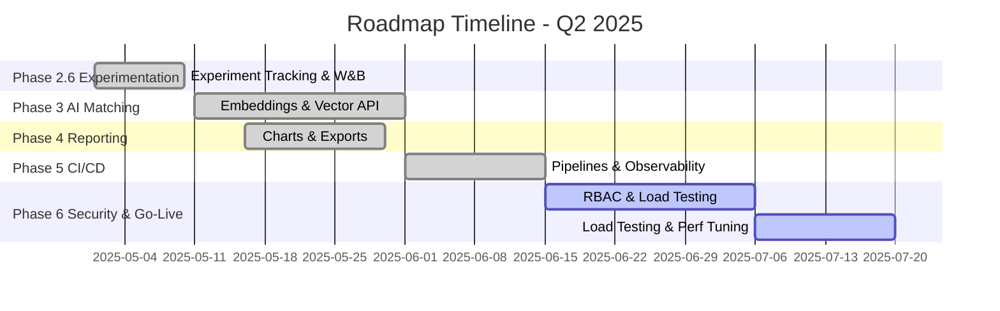

# Roadmap: Next-Gen AI-Powered SaaS Matching Platform

| Phase                        | Task                                                   | Status        | Progress | Priority  | ETA          |
|------------------------------|--------------------------------------------------------|---------------|----------|-----------|--------------|
| Phase 1: Data Ingestion      | Pipeline, entity extraction (Gemini & Transformers)    | ✅ Completed  | 100%     | Low       | Done         |
| Phase 2: Frontend & UX       | App Router pages, i18n, mock API & skeleton loaders    | ✅ Completed  | 100%     | Medium    | Done         |
| Phase 2.5: Evaluation        | Evaluation service & dashboard (MLflow)                | ✅ Completed  | 100%     | High      | Done         |
| Phase 2.6: Experimentation   | FastAPI hyperparam tuning & W&B integration            | ✅ Completed  | 100%     | Critical  | Done         |
| Phase 3: AI Matching         | Embeddings API, vector store, summarization & tRPC     | ✅ Completed  | 100%     | High      | Done         |
| Phase 4: Reporting & Analytics| PDF/Excel reports & analytics dashboards               | ✅ Completed  | 100%     | Medium    | Done         |
| Phase 5: CI/CD & Observability | GitHub Actions, Sentry & OpenTelemetry               | ✅ Completed  | 100%     | Medium    | Done         |
| Phase 6: Security & Go-Live   | RBAC, load testing, performance tuning & cutover (centralized secrets via .env) | 🚧 In Progress | 10%      | Low       | Mid June ‘25 |

---

## Status Legend

- ✅ Completed  (100%)
- 🚧 In Progress  (1–99%)
- ⬜ Planned  (0%)

## Upcoming Priorities

1. Harden security policies & load testing (Phase 6)
2. Finalize performance tuning & go-live cutover

### Security & Go-Live Checklist
- [x] Centralize all API keys, JWT secrets, and passwords in `.env` file
- [ ] Rotate secrets before production cutover
- [ ] Audit environment variable usage and restrict access

## Timeline

